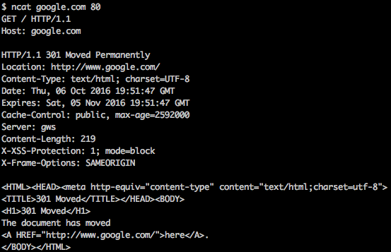

# Udacity HTTP & Web Servers Courses

## Parts of a URI
`URI`可以说是一种资源名字，比如微博页面，维基百科的文章和一些像谷歌地图API的数据源都是`URI`。

例如： `https://en.wikipedia.org/wiki/Fish
这个例子中`URI`由三个不同的部分组成：

>* `https` 为URI协议名 `scheme`
>* `en.wikipedia.org` 为主机名 `hostname`
>* `/wiki/Fish` 为路径 `path`

### Scheme
`scheme`告诉客户端如何访问相关资源。我们常见的`scheme`有`http`, `https`, `file`。其中文件`URI`告诉客户端访问本地文件系统上的文件。HTTP和HTTPS `URI`指向Web服务器提供的资源。

[更多关于URI scheme]('http://www.iana.org/assignments/uri-schemes/uri-schemes.xhtml')

### Hostname
主机名告诉客户端应该连接哪个服务器

我们经常可以看到网页地址只显示出主机名，但是在HTML中，我们不能写类似这样的代码：`<a href="www.google.com">this</a>`来去链接谷歌。主机名只能出现在支持它的`URI`协议名之后，例如HTTP，HTTPS。在这些`URI`中协议名个主机名之间总会有`://`跟着。

但是，并不是所有`URI`都有主机名。比如`mailto`只有一个邮箱地址：`mailto:spam@example.com`。这也说明了`URI`中`:`会跟在协议名后面，但是Mailto的链接没有主机名的部分，所以它不需要`//`。

### Path
路径，标识了服务器上的特定资源。一个服务器上可以有非常多的资源，路径名可以告诉服务器客户端正在找的具体是哪个资源。

### Relative URI references
在HTML中我们也经常看到类似这样的代码：`<a href="cliffsofinsanity.png">cliffsofinsanity.png</a>`。

像这种`URI`没有协议名和主机名，仅仅路径的`URI`我们叫做`relative URI reference.` 相对URI引用。它与它出现的上下文是“相对的”，具体来说就是它所在的页面。此URI不包括其所在服务器的主机名或端口，但浏览器可以从上下文中了解。如果我们点击其中一个链接，浏览器会从上下文中知道，它需要从与原始页面相同的服务器中获取它。

## Hostnames and ports
### Hostnames
一个完整的HTTP或HTTPS`URI`包含了Web服务器的主机名，比如`www.google.com`,`www.bing.com`等等。`URI`里的主机名也可以是IP地址，比如你在浏览器里输入`http://216.58.194.174/`，你可以链接到谷歌主页中。

互联网通过IP地址告诉计算机；互联网上的每一个网络流量都标有发送和接收计算机的IP地址。为了连接像`www.udacity.com`的Web服务器，客户端需要将主机名转换为IP地址。我们的操作系统的网络配置使用域名服务（DNS） - 由Internet服务提供商（ISP）和其他网络用户维护的一组服务器来查找主机名并获取IP地址。

我们可以使用`host` 或者 `nslookup` 来查看主机名的IP地址。

IP地址有两种不同的类型。比较旧的`IPv4`和比较新的`IPv6`。当你看到类似`127.0.0.1`或者`216.58.194.164`的地址，这些就是`IPv4`地址。`IPv6`地址更长，例如`2607:f8b0:4005:804::2004`，但是它们也可以被缩写。比如`::1`为`0000:0000:0000:0000:0000:0000:0000:0001`的缩写。

### Localhost
`IPv4`地址`127.0.0.1`和`IPv6`地址`::1`是特殊地址，意思是“这台电脑本身” - 当客户端（如浏览器）访问自己的计算机上的服务器时。主机名`localhost`也就是这个特殊地址。

### Ports
大部分网页地址都看不到有端口号，这是因为客户端一般可以从`URI`协议名中获取到。

比如，80端口为HTTP协议的默认端口，443端口为HTTPS协议的默认端口。

那什么是端口号呢？计算机发送和接收的所有网络流量 - 从Web请求到登录会话到文件共享的所有网络流量被分割成称为数据包的消息。每个数据包都具有发送它的计算机的IP地址和接收它的计算机。并且（除了一些低级数据包，例如ping），它还具有发送方和收件人的端口号。IP地址区分电脑，端口号区分这些计算机上的程序。

## HTTP GET requests
`127.0.0.1 - - [03/Oct/2016 15:45:50] "GET /readme.png HTTP/1.1" 200 -`
其中`GET /readme.png HTTP/1.1`为请求行，有浏览器发送给服务器。

这个日志是服务器告诉你它收到了一个请求，请求行为`GET /readme.png HTTP/1.1`。

请求由三个部分组成。

1. `GET`为请求方法或`HTTP verb`，说明了这是什么请求。`GET`是客户端在需要服务器发送资源（如网页或图像）时使用的动词。
2. `readme.png` 为被请求的资源的路径。我们可以注意到客户端不需要发送资源的整个`URI`，不需要像这样：`https://localhost:8000/readme.png`，只需要发送路径。
3. `HTTP/1.1`为请求的协议`protocol`。

## HTTP responses
HTTP响应由三部分组成：状态行，响应标头，响应体。（`status line`, `headers`, `response body`）

其中，状态行在服务器返回的信息的第一行，响应头是直到第一个空白行为止的其他行，剩下的就为响应体。

### Status line
状态行告诉客户端服务器是否理解请求，服务器是否有客户端要求的资源，以及下一步如何进行。

类似200，301，304，404等等为状态码（`status code`）状态码有好几十中，其中状态代码的第一位数字表示请求成功与否。

>* `1xx` - 信息。请求正在进行或还有另一个步骤。
>* `2xx` - 成功！请求成功。服务器正在发送客户端要求的数据。
>* `3xx` - 重定向。服务器告诉客户端应该重定向到的不同的URI。标题通常会包含一个具有更新URI的Location头文件。不同的代码告诉客户端重定向是永久还是暂时的。
>* `4xx` - 客户端错误。服务器不了解客户的请求，或者不能也不会填写。不同的代码告诉客户端是不是一个坏的URI，一个权限问题，或另一种错误。
>* `5xx` - 服务器错误。服务器端发生错误。

### Headers
HTTP响应可以包括许多响应头。每个响应头都是一个以一个关键字开始的行，例如Location或Content-type，后跟一个冒号和一个值。响应头是响应的一种元数据。浏览器或其他客户端不显示它们;而是告诉客户有关响应的各种信息。

Web的许多功能都是使用响应头来实现的。例如，Cookie是一种Web功能，可让服务器在浏览器上存储数据，例如保持用户登录状态。要设置cookie，服务器发送Set-Cookie头。然后，浏览器会将后续请求中的Cookie数据发送回Cookie头。

Content-type头指示服务器正在发送的数据类型。它包括一般内容类别以及具体格式。例如，PNG图像文件将附带`Content-type image / png`。如果内容是文本（包括HTML），服务器也会告诉它使用什么编码来写入（`uft-8`）。UTF-8是一个非常常见的选择，它也是Python文本的默认设置。

### Response body
响应头以空白行结束。空白行之后的一切都是响应体的一部分。如果请求成功（例如，200 OK状态），则响应体为客户端要求的任何资源（例如网页，图像或其他数据）的副本。

但是在出现错误的情况下，响应体就为错误消息！如果你要求的页面不存在，并且你收到404 Not Found错误，实际的错误信息将显示在响应体。