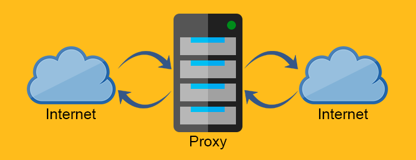
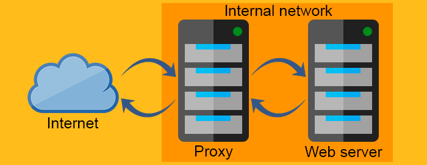
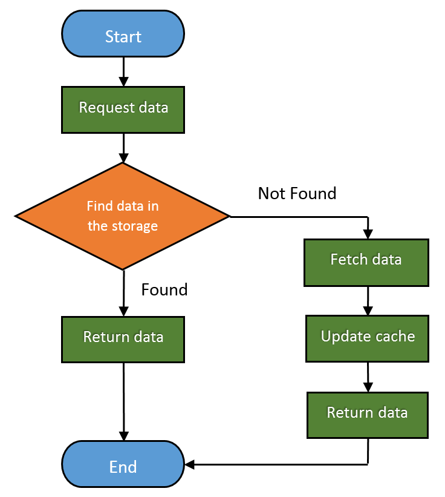

# THE HTTP SERIES(PART 2): ARCHITECTURAL ASPECTS

在PART 1中，我们讨论了HTTP的基础概念，接下来我们将基于PART 1的内容更进一步地进行探讨，我们将探讨HTTP架构方面的东西而不只是数据的收发。

HTTP作为应用协议无法自我发挥作用，它需要基于硬件和软件的解决方案来提供不同的服务，并使互联网通信称为可能并且高校。

在本章节，你将学习到如下知识点：

* Web Servers
* Proxy Servers
* Caching
* Gateways, Tunnels, and Relays
* Web Crawlers

这些是互联网的组成部分，你将了解到它的每一部分是干什么的，还有怎么进行工作的。这些知识将帮助你把PART 1里的知识点连成线，从而更好地了解HTTP通信的流程。

## Web Servers Web服务器

正如PART 1所阐述的那样，Web服务器最基本的功能就是储存[资源]('http://www.code-maze.com/http-protocol-overview-part1/#Resources')和在接受到请求后为它们服务。你可以通过Web客户端（即浏览器）访问Web服务器，并返回获取所请求的资源或更改现有资源的状态。Web服务器也可以通过网页爬虫自动获取相关信息，我们将在本文后面讲到。

<div align="center">
    
</div>

你或许也听说过一些比较流行的Web服务器，譬如`Apache HTTP Server`，`Nginx`，`IIS`和`Glassfish`等等。

软件应用中的Web服务器可以有简单到复杂，现代Web服务器可以执行很多不同的任务。Web服务器应该能够执行如下的基本任务：

* <b>设置连接</b> - 接受或关闭客户端连接
* <b>接受请求</b> - 读取HTTP请求消息
* <b>处理请求</b> - 解析请求消息并处理
* <b>获取资源</b> - 获取消息中指定的资源
* <b>构建响应</b> - 创建HTTP响应消息
* <b>发送响应</b> - 发送响应消息给客户端
* <b>日志记录</b> - 将完整的请求响应过程记录在日志里

接下来我将会把Web服务器的工作流程拆成几个阶段来讲，每个阶段都代表着Web服务器工作流程简化步骤。

### Phase 1: Setting up connection 设置连接
当Web客户端想要访问Web服务器时，它必须试着打开一个新的TCP连接。在另一边，服务器会尝试提取客户端的IP地址。在这些之后，服务器将会决定是否打开或关闭与客户端之间的TCP连接。

如果服务器接受了连接，它会把这个连接添加进已有的连接表中，并监听连接的数据。

如果客户端没被验证或是黑名单的，服务器也可以关闭连接。

服务器还可以使用“反向DNS”来尝试识别客户端的主机名。这个信息可以帮助记录消息，但是主机名查找可能需要一段时间，减慢事务处理。

#### Phase 2: Receiving/Processing requests 接受/处理请求
解析传入的请求时，Web服务器解析来自消息请求行，请求头和请求主体（如果有的话）的信息。需要注意的一点是连接可以在任何时间里进行解析，在这种情况下，服务器必须临时储存信息，直到接受到其余的数据。

高性能的Web服务器还应该能够同时打开许多的连接，其中包括了来自同一客户端不同的并发连接。一个典型的网页可以从服务器中请求不同的资源。

### Phase 3: Accessing the resource 获取资源
由于Web服务器主要是资源提供者，因此它们具有多种映射和访问资源的方法。

最简单的方法就是使用请求`URI`在Web服务器的文件系统中查找文件映射资源。一般来说，资源包含在服务器的特定目录下，称为文档根目录。例如，在Windows服务器的文档根目录可以位于`F:\WebResources\`。如果一个`GET`请求想要获取在`/images/cidemazeblog.txt`中的文件，服务器将其转译为`F:\WebResources\images\codemazeblog.txt`并且在响应消息中返回请求的文件。当多个网站托管在Web服务器上时，每个网站都可以有单独的文档根目录。

如果一个Web服务器接收到的是对目录而不是文件的请求，它可以通过几种方法来解决。它可以返回一个错误的消息，可以返回默认的索引文件或扫描目录并返回HTML文件的内容。

服务器还可以将请求`URI`映射到动态资源中-产生一些结果的软件应用程序。有一类称为应用服务器的服务器，其目的是将Web服务器连接到复杂的软件解决方案并提供动态内容。

### Phase 3: Generating and sending the response 生成并发送响应
一旦服务器识别出需要提供的资源，就会生成响应消息。响应消息包含`status code`状态码，`response headers`响应头和响应主体（如果需要的话）。

如果返回的响应消息包含了响应主体，那它一般也会包含`Content-Length`响应头来描述响应主体的大小和`Content-Type`响应头来描述返回资源的`MIME type`MIME类型。

生成响应后，服务器会选择需要发送响应的客户端。对于非持久性的连接，当所有响应发送完毕时，服务器需要关闭连接。

### Phase 4: Loggin 记录
当事务处理完毕后，服务器会记录所有事务信息。很多服务器提供日志记录定制。

## Proxy Servers 代理服务器
代理服务器（代理）为中介服务器，它们一般存在于Web服务器和Web客户端之间。由于它们的特性，代理服务器需要表现得像Web客户端又像Web服务器。

但是我们为什么需要代理服务器呢？为什么我们不能直接在Web服务器和Web客户端进行通信？使用代理服务器会更简单更快吗？

可能会更简单，但不一定更快，我们后面将会讲到它。

在解释使用什么代理服务器之前，我们需要先弄懂一件事，就是反向代理的概念和转发代理与反向代理之间的不同。

转发代理充当客户端向Web服务器请求资源的代理服务器，它通过防火墙或客户端的隐藏信息过滤请求来保护客户。反向代理工作模式与之完全相反。它一般位于防火墙的后方来保护Web服务器。对于所有的用户来说，他们在与真实的Web服务器通信时并不知道反向代理背后的网络。

### Proxy server

<div align=center>
    
</div>

### Reverse proxy server

<div align=center>
    
</div>

代理用处非常大，其应用场景也非常广泛，接下来让我们来看看一些代理服务器使用的场景。

> * <b>Compression 压缩</b> - 压缩内容可以直接提升通信速度，就是如此简单。
> * <b>Monitoring and filtering 监控和过滤</b> - 想要在学校里屏蔽成人信息吗？那么代理即可以帮你解决。
> * <b>Security 安全</b> - 代理可以作为整个网络的单个接入点，它们可以检测恶意应用程序并限制应用程序级协议。
> * <b>Anonymity 匿名</b> - 请求可以通过代理进行修改来达到更好的匿名效果，它可以从请求中删除敏感信息，只留下重要的东西。通过发送少量的信息给服务器可能会降低用户体验，但是匿名有时候更为重要。
> * <b>Access control 访问控制</b> - 正如所说，你可以将许多的服务器访问控制集中在一个代理服务器中。
> * <b>Caching 缓存</b> - 你可以使用代理服务器来缓存经常使用的内容，从而来大幅减小加载时间。
> * <b>Load balancing 均衡负载</b> - 如果你的服务器出现“流量峰值”，你可以使用代理服务器在更多的计算资源或Web服务器上分配工作负载。均衡负载可以路由流量，以避免在高峰发生时超载单个服务器。
> * <b>Transcoding 转译</b> - 代理也可以改变消息主体的内容。

就如你缩减，代理是非常常用和灵活的。

## Caching 缓存
网页缓存是设备自动生成所请求数据的副本并将其保存在本地存储中。

通过这种方式，它们可以达到一下效果：

> * <b>降低通信流量</b>
> * <b>消除网络瓶颈</b>
> * <b>防止服务器过载</b>
> * <b>减少长距离的响应延迟</b>

因此你可以直接说Web缓存提升了用户体验和改善了Web服务器的性能，当然这样也可以节省许多成本。

我们将缓存中提供的请求的分数称为<b>Hit Rate</b>命中率,从0到1进行排序，0代表0%和1代表100%的请求，理想的目标当然是达到100%，但实际数字通常接近40%。

下面是Web缓存的基本工作流程：

<div align=center>
    
</div>

## Gateways, Tunnels, and Relays  网关，隧道和中继
随着HTTP的成熟，人们发现了许多不同的使用方式。HTTP作为连接不同应用和协议的框架将变得非常有用。

让我们来看看。

### Gateways 网关
网关是指可以通过抽象获取资源的方式时HTTP与不同的协议和应用程序通信的硬件。它们也被称为协议转换器，并且由于使用多种协议，因此比路由器或交换机复杂得多。

例如，你可以使用网关通过发送HTTP请求来通过FTP获取文件，或者你可以通过SSL接收加密的消息，并将其转换为HTTP（客户端安全加速器网关）或将HTTP转换为更安全的HTTP消息（服务器端安全网关）。

### Tunnels 隧道
隧道利用`CONNECT request method`CONNECT请求方法，使其能够通过HTTP发送非HTTP数据。CONNECT方法要求隧道打开与目标服务器的连接，并在客户端和服务器之间转发数据。

CONNECT 请求：
```http
CONNECT api.github.com:443 HTTP/1.0
User-Agent: Chrome/58.0.3029.110
Accept: text/html,application/xhtml+xml,application/xml
```

COMNECT 响应：
```http
HTTP/1.0 200 Connection Established
Proxy-agent: Netscape-Proxy/1.1
```

CONNECT响应不需要像常见的HTTP响应一样指定`Content-Type`。

建立连接后，可以直接在客户端和服务器之间发送数据。


### Relays 中继
中继不属于HTTP规则里一员，它不需要遵循HTTP的规则。它们时代理的转储版本，只要可以使用请求消息中最小信息建立连接，就可以中继其接收的任何信息。

它存在的原因时为了尽可能减少使用代理的麻烦程度，它也可以变得很麻烦，但其使用的场景非常多，在使用中继时肯定是需要考虑受益比的风险的。