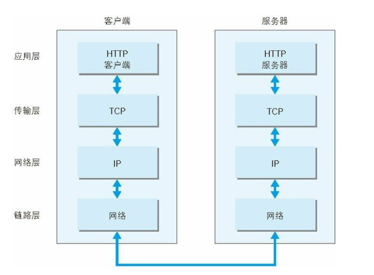
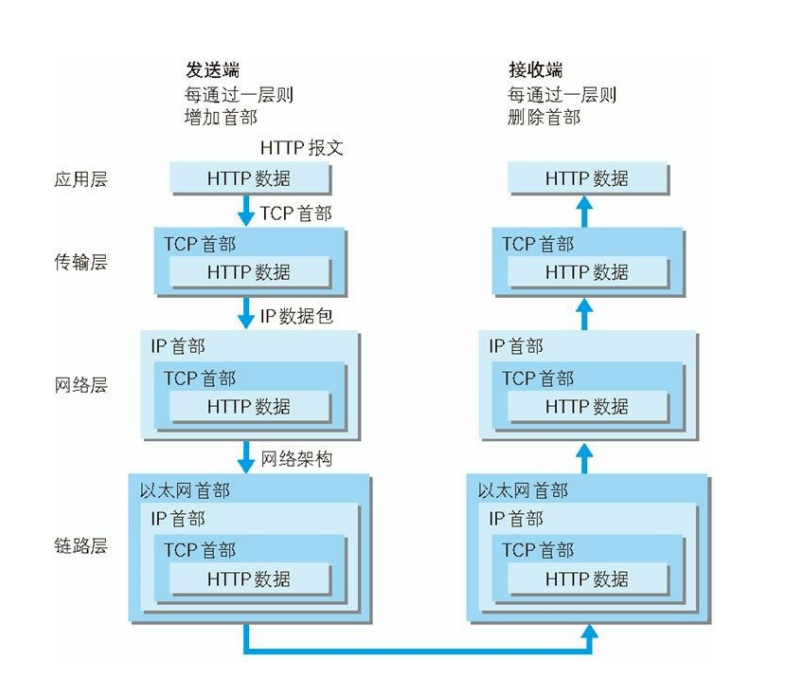

## TCP/IP

### TCP/IP 协议族

计算机与网络设备要相互通信，双方就必须基于相同的方法。比如，如何探测到通信目标、由哪一边先发起通信、使用哪种语言进行通信、怎样结束通信等规则都需要事先确定。不同的硬件、操作系统之间的通信，所有的这一切都需要一种规则。而我们就把这种规则称为协议（protocol）。

### TCP/IP 的分层管理

TCP/IP 协议族里重要的一点就是分层。TCP/IP 协议族按层次分别分为以下4层：

* 应用层：应用层决定了向用户提供应用服务时通信的活动。TCP/IP 协议族内预存了各类通用的应用服务。比如，FTP(File Transfer Protocol, 文件传输协议)和DNS(Domain Name System, 域名系统)服务就是其中两类。HTTP协议也处于该层。
* 传输层：对上层应用层，提供处于网络连接中的两台计算机之前的数据传输。再传输层有两个性质不同的协议：TCP(Transmission Control Protocol, 传输控制协议) 和 UDP(User Data Protocol, 用户数据报协议)。
* 网络层：网络层用来处理在网络上流动的数据包。数据包时网络传输的最小数据单位。该层规定了通过怎样的路径（所谓的传输路线）到达对方计算机，并把数据包传送给对方。
* 链路层：用来处理连接网络的硬件部分。包括空值操作系统、硬件的设备驱动、NIC（Network Interface Card，网络适配器、即网卡
，及光纤等物理可见部分（还包括连接器等一切传输媒介）。硬件上的范畴均在链路层的作用范围之内。

### TCP/IP 通信传输流

利用TCP/IP 协议族进行网络通信时，会通过分层顺序与对方继续宁通信。发送端从应用层往下走，接收端则往应用层往上走。

发送端在层与层之间传输数据时，每经过一层时必定会被打上一个该层所属的首部信息。反之，接收端在层与层传输数据时，每经过一层时会把对应的首部消去。

这种把数据信息包装起来的做法称为封装（encapsulate)。

## 后续阅读

[What Happens When You Type in a URL](https://wsvincent.com/what-happens-when-url/)
[What happens when you type an URL in the browser and press enter?](https://medium.com/@maneesha.wijesinghe1/what-happens-when-you-type-an-url-in-the-browser-and-press-enter-bb0aa2449c1a)